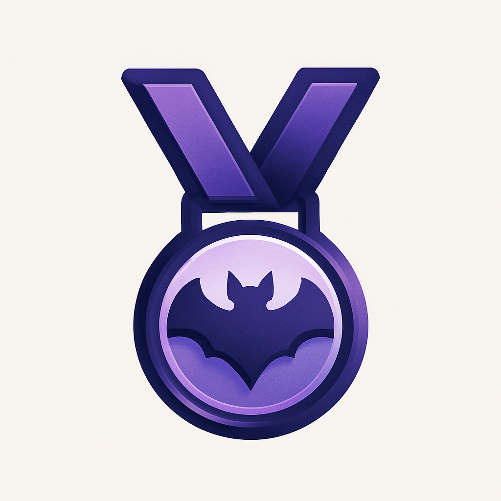

# CaverBob.org

  

## Descripción

CaverBob.org es una plataforma web dedicada a mostrar y mantener el ranking mundial de cuevas. La aplicación está dedicada a la memoria de Robert Gulden y sirve como un repositorio central para la información sobre cuevas de todo el mundo.

## Características Principales

- 📊 **Rankings de Cuevas**

  - Cuevas más largas
  - Cuevas más profundas
  - Pozos profundos
  - Cámaras más grandes

- 🔐 **Autenticación**

  - Inicio de sesión con Google
  - Perfiles de usuario personalizados
  - Sistema de permisos basado en roles

- 💬 **Sistema de Comentarios**

  - Discusiones por cueva
  - Foro comunitario
  - Interacción entre usuarios

- 📝 **Reportes de Datos**

  - Envío de nuevos datos sobre cavidades
  - Actualización de información existente
  - Sistema de verificación de datos

- 🌍 **Internacionalización**
  - Soporte multiidioma
  - Interfaz en español e inglés
  - Adaptación a diferentes regiones

## Tecnologías Utilizadas

- **Frontend**

  - Next.js
  - React
  - Tailwind CSS
  - TypeScript

- **Backend**

  - Supabase
  - Node.js
  - API Routes

- **Autenticación**

  - Google OAuth
  - Supabase Auth

- **Despliegue**
  - Vercel
  - CI/CD automático

## Contribución

Las contribuciones son bienvenidas.

## Licencia

Este proyecto está bajo la Licencia MIT. Ver el archivo `LICENSE` para más detalles.

## Contacto

Para soporte o consultas, por favor utiliza el formulario de contacto en la aplicación o envía un email a [kiyameh@outlook.com](mailto:kiyameh@outlook.com).
